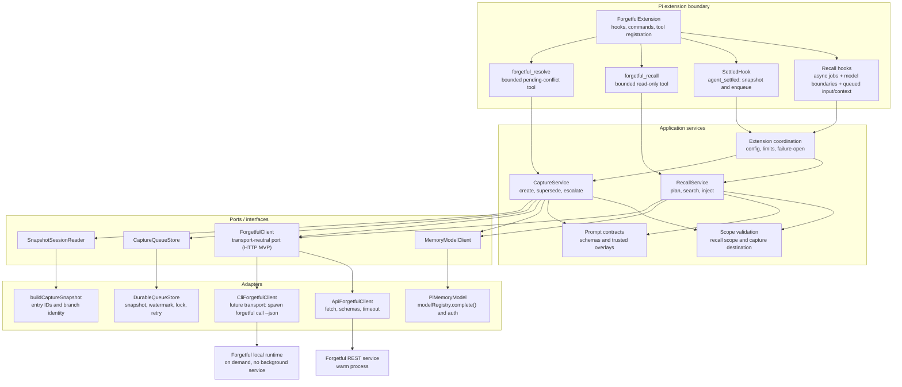

# Pi Forgetful

A seamless persistent-memory extension for the Pi coding agent.

The intended experience requires no memory commands during normal work:

- a separately configured memory model decides whether each prompt needs memory asynchronously;
- recall lifecycle messages and bounded context reach the main model only at model-call boundaries;
- the rendered latest recall state is transient; automatic pending and empty-wake markers persist;
- `forgetful_recall_wait` results use normal Pi tool-result persistence;
- the main agent receives bounded leads it can explore through a read-only recall tool;
  normal Pi tool-result persistence is accepted and documented;
- durable knowledge is captured quietly after successful work settles through a durable queue;
- capture resolves clear contradictions and defaults each memory to the current project, with
  agent-selected destinations for knowledge about another existing project;
- debug, scope, capture-mode, model, prompt, and enablement controls remain available on demand.

Recall defaults to global search independently of capture's project association. Clear changes
automatically supersede old memories while preserving history. Uncertain conflicts go to the
originating session's next prompt; `forgetful_resolve` accepts only a pending conflict ID and
validated evidence from that session.
Post-exit capture completion is deferred beyond MVP; the durable queue remains in scope.

See [the approved design](docs/design.md).

## High-level architecture

The extension keeps Pi lifecycle code separate from memory policy and transport details. The MVP
uses a warm HTTP REST service behind a transport-neutral Forgetful client port; a CLI adapter can
be added later without changing the application services. Forgetful MCP transport is deliberately
not used by this extension.

The HTTP path is the MVP and amortises startup cost across prompts by using a warm Forgetful
service. A future CLI adapter could start the installed Forgetful runtime on demand, but it is
not part of the first slice. Both paths must preserve strict project scope, bounded timeouts,
schema validation, and fail-open behaviour.

An editable Excalidraw version of this architecture is available at
[docs/code-architecture.excalidraw](docs/code-architecture.excalidraw).

## Status
MVP implemented for Pi 0.85.1 with TDD and parent review. Run `npm run check` for the current
regression/integration results, including the real Pi SDK and Forgetful REST routes against an
isolated database. Set `FORGETFUL_TEST_SOURCE` to the Forgetful checkout to run its REST tests.
Real-model judgment quality and latency remain separate acceptance checks.
See [setup and controls](README.md).
