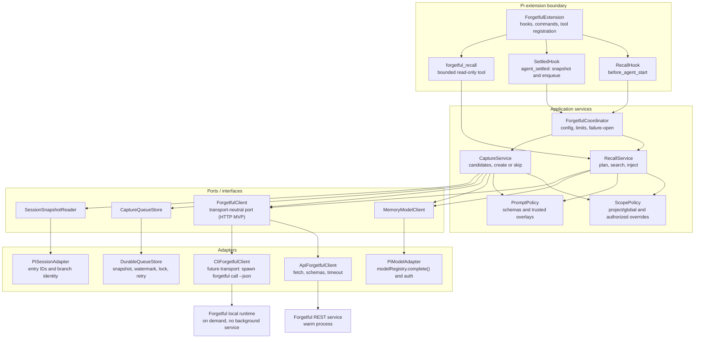

# Pi Forgetful

A seamless persistent-memory extension for the Pi coding agent.

The intended experience requires no memory commands during normal work:

- a separately configured memory model decides whether each prompt needs memory;
- relevant Forgetful context is injected into the same agent turn;
- the main agent receives bounded leads it can explore through a read-only recall tool;
  normal Pi tool-result persistence is accepted and documented;
- durable knowledge is captured quietly after successful work settles through a durable queue;
- debug, scope, capture-mode, model, prompt, and enablement controls remain available on demand.

See [the approved design](docs/design.md) and the
[visual architecture review](docs/architecture-review.html).

## High-level architecture

The extension keeps Pi lifecycle code separate from memory policy and transport details. The MVP
uses a warm HTTP REST service behind a transport-neutral Forgetful client port; a CLI adapter can
be added later without changing the application services. Forgetful MCP transport is deliberately
not used by this extension.

The HTTP path is the MVP and amortises startup cost across prompts by using a warm Forgetful
service. A future CLI adapter could start the installed Forgetful runtime on demand, but it is
not part of the first slice. Both paths must preserve strict project scope, bounded timeouts,
schema validation, and fail-open behaviour.

An editable Excalidraw version of this architecture is available at
[docs/code-architecture.excalidraw](docs/code-architecture.excalidraw).

## Status
Design approved. Implementation has not started.
