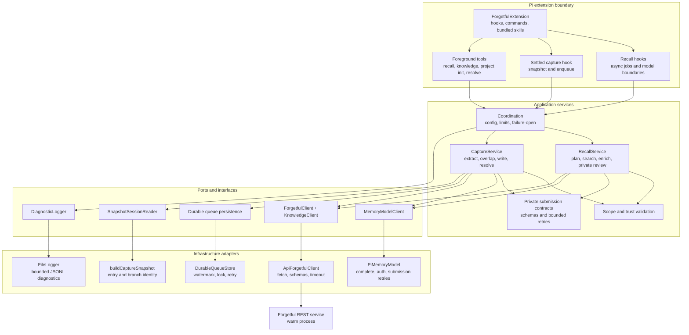

# Pi Forgetful

A seamless persistent-memory extension for the Pi coding agent.

The intended experience requires no memory commands during normal work:

- a separately configured memory model plans recall while the main agent starts work;
- automatic recall gives the main agent only bounded context reviewed through a private,
  schema-validated submission tool; raw search results are never a fallback;
- the latest rendered recall state is transient; the initial pending marker and any useful-result
  background-completion marker persist as hidden Pi entries;
- `forgetful_recall_wait` and foreground tool results use normal Pi tool-result persistence;
- the main agent can search memories, inspect rich knowledge, initialise projects, and write
  evidenced repository knowledge through bounded tools;
- successful settled work is captured through a durable queue using validated extraction and
  overlap submissions with bounded correction attempts;
- capture can create and link memories, entities, relationships, documents, and code artifacts;
  file uploads are excluded;
- configured recall scope is authoritative and independent of each capture destination;
- setup, project, encode, logging, verbosity, scope, capture, model, and enablement controls remain
  available on demand.

Recall defaults to global search. Capture defaults to the current project, but may select another
existing project when the evidence supports it. Clear complete changes supersede old memories while
preserving history. Uncertain conflicts return to their originating session. `forgetful_resolve`
accepts a pending conflict ID and action; supplied evidence is validated against the originating
session. An eligible conflict against one memory can produce a complete revised replacement that
preserves unaffected claims and links; unsafe partial or shared conflicts remain pending or can be
skipped.

Post-exit capture completion remains beyond the MVP; the durable queue remains in scope.
See [the approved design](docs/design.md).

## High-level architecture

Pi lifecycle code remains separate from memory policy and transport details. The MVP uses a warm
HTTP REST service behind transport-neutral memory and knowledge ports. Forgetful MCP transport is
not used. A future CLI adapter must preserve the same scope, validation, timeout, and failure-open
boundaries.

An editable Excalidraw version is available at
[docs/code-architecture.excalidraw](docs/code-architecture.excalidraw).

## Status

MVP implemented for Pi 0.85.1 with TDD and parent review. Run `npm run check` for deterministic
regression and real Pi SDK integration tests. Set `FORGETFUL_TEST_SOURCE` to a Forgetful checkout
for isolated real REST tests. Real-model judgment and latency checks are separately opt-in.
See [setup and controls](README.md).
