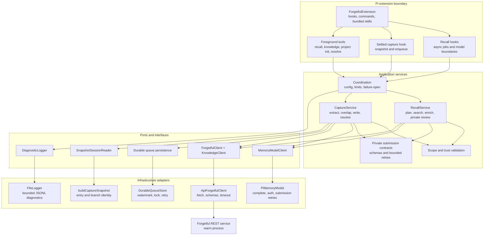

# Pi Forgetful

A seamless persistent-memory extension for the Pi coding agent.

The intended experience requires no memory commands during normal work:

- a separately configured memory model plans recall while the main agent starts work;
- every behavior-driving private model response uses a schema-validated submission tool, never
  parsed JSON text; compaction summaries remain contextual text;
- automatic recall gives the main agent only bounded context reviewed through a private,
  schema-validated submission tool; raw search results are never a fallback;
- pending and retrieval recall states are transient; each useful reviewed result is saved once
  as a hidden Pi conversation message, available to later requests and normal compaction;
- the initial pending marker persists normally; the useful result itself continues the turn,
  without a separate saved wake; recalled facts are untrusted and excluded from capture evidence;
- `forgetful_recall_wait` and foreground tool results use normal Pi tool-result persistence;
- the main agent can search memories, inspect rich knowledge, initialise projects, and write
  evidenced repository knowledge through bounded tools;
- settled capture pins session/branch history, reusing a successful historical summary plus
  recent messages; source evidence remains durable until success or three failed/paused attempts,
  after which the job and associated conflicts are discarded with a final UI outcome;
- snapshots remain separate from the 50 MiB queue index; watermarks prevent replay independently
  of context summarisation, and completed jobs retain only small outcome records;
- capture can inspect sources read-only; recall can explore only stored Forgetful knowledge;
- private tasks use a configurable 100k-token context limit, capped by the selected model window,
  with Pi compaction settings, reply generation capped to the model/reserve/remaining budget,
  validated submissions and bounded correction attempts;
- successful summary cursors move forward per session/branch; inactive summary caches expire,
  and cache damage falls back to pinned history without masking original-source failures;
- capture can create and link memories, entities, relationships, documents, and code artifacts;
  file uploads are excluded;
- configured recall scope is authoritative and independent of each capture destination;
- setup, project, encode, logging, verbosity, scope, capture, model, and enablement controls remain
  available on demand.

Recall defaults to global search. Capture defaults to the current project, but may select another
existing project when the evidence supports it. Clear complete changes supersede old memories while
preserving history. Uncertain conflicts return to their originating session. `forgetful_resolve`
accepts a pending conflict ID and action; supplied evidence is validated against the originating
session. An eligible conflict against one memory can produce a complete revised replacement that
preserves unaffected claims and links; unsafe partial or shared conflicts remain pending or can be
skipped.

Post-exit capture completion remains beyond the MVP; the durable queue remains in scope.
See [the approved design](docs/design.md).

## High-level architecture

Pi lifecycle code remains separate from memory policy and transport details. The MVP uses a warm
HTTP REST service behind transport-neutral memory and knowledge ports. Forgetful MCP transport is
not used. A future CLI adapter must preserve the same scope, validation, timeout, and failure-open
boundaries.

```mermaid
flowchart TB
  subgraph PI["Pi extension boundary"]
    E["ForgetfulExtension\nhooks, commands, bundled skills"]
    R["Recall hooks\nasync jobs and model boundaries"]
    S["Settled capture hook\nsnapshot and enqueue"]
    T["Foreground tools\nrecall, knowledge, project init, resolve"]
    E --> R
    E --> S
    E --> T
  end

  subgraph CORE["Application services"]
    C["Coordination\nconfig, limits, failure-open"]
    RS["RecallService\nplan, search, enrich, private review"]
    CS["CaptureService\nextract, overlap, write, resolve"]
    SP["Scope and trust validation"]
    PP["Private submission contracts\nschemas and bounded retries"]
    C --> RS
    C --> CS
    RS --> SP
    RS --> PP
    CS --> SP
    CS --> PP
  end

  subgraph PORTS["Ports and interfaces"]
    MM["MemoryModelClient"]
    FM["ForgetfulClient + KnowledgeClient"]
    QS["Durable queue persistence"]
    SR["SnapshotSessionReader"]
    DL["DiagnosticLogger"]
  end

  subgraph ADAPTERS["Infrastructure adapters"]
    PM["PiMemoryModel\ncomplete, auth, submission retries"]
    API["ApiForgetfulClient\nfetch, schemas, timeout"]
    DS["DurableQueueStore\nwatermark, lock, retry"]
    PS["buildCaptureSnapshot\nentry and branch identity"]
    FL["FileLogger\nbounded JSONL diagnostics"]
  end

  R --> C
  S --> C
  T --> C
  RS --> MM
  RS --> FM
  CS --> MM
  CS --> FM
  CS --> QS
  CS --> SR
  C --> DL
  MM --> PM
  FM --> API
  QS --> DS
  SR --> PS
  DL --> FL
  API --> REST["Forgetful REST service\nwarm process"]
```

An editable Excalidraw version is available at
[docs/code-architecture.excalidraw](docs/code-architecture.excalidraw).

## Forgetful Integration and Agent Tool behaviour
It is important to note that responses from forgetful are not masked or obscured to by the tools
and that the agent is able too understand why a request to forgetful failed, as such we should
pass the execption or response body to the model without translation into our own interpretation.

That means the model should see what Forgetful actually said, including for:

 - all HTTP statuses, including 5xx;
 - JSON and non-JSON bodies;
 - validation field details;
 - plain 404 bodies such as Not Found;
 - service diagnostics when they are present.
## Repository hygiene

Keep agent handoffs and disposable review reports outside the repository. Put durable guidance in
existing documentation, not session-summary documents. Remove temporary review artifacts when the
review ends unless the user asks to keep them.

## Status

MVP implemented for Pi 1. Run `npm run check` for deterministic
regression and real Pi SDK integration tests. Set `FORGETFUL_TEST_SOURCE` to a Forgetful checkout
for isolated real REST tests. Real-model judgment and latency checks are separately opt-in.
See [setup and controls](README.md).
