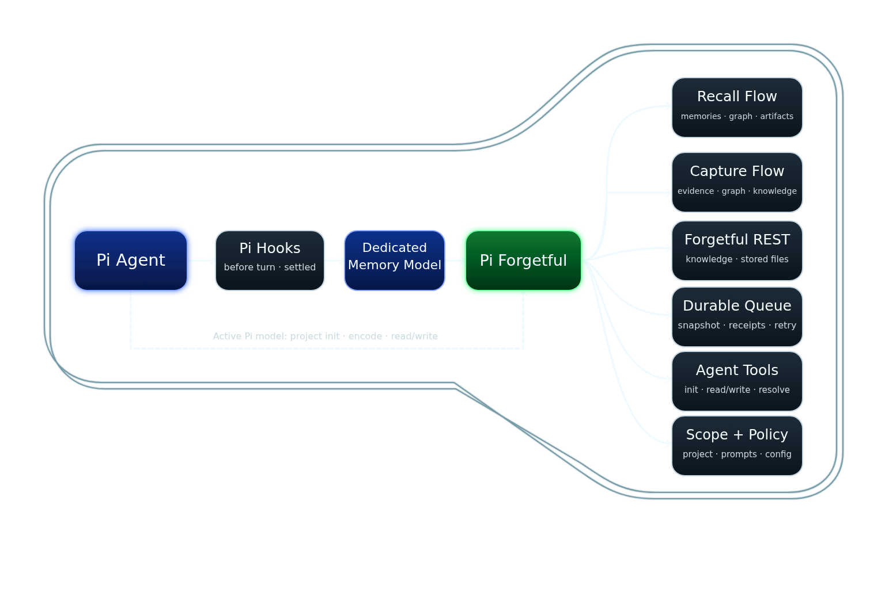

# Pi Forgetful

Automatic persistent memory for the [Pi coding agent](https://pi.dev/), using the existing
[Forgetful REST service](https://github.com/ScottRBK/forgetful).

A separately selected memory model recalls relevant context before normal work and captures
durable, evidenced knowledge after work settles. Clear contradictions automatically supersede
old memories while preserving their history. Uncertain conflicts return to the originating
session for resolution through a bounded tool.



## Architecture

Pi sends ordinary prompts and completed work to the extension. Recall asks the separately
configured memory model whether to search, performs a bounded request against a warm Forgetful
HTTP service, and injects only the strongest context into the active turn. Capture snapshots the
settled session branch, persists it in a durable queue, and processes candidates through
query-before-create, supersession, or conflict escalation. Memory failures are failure-open and
must not block the user's task.

HTTP is the MVP transport. The application services depend on a transport-neutral Forgetful client
port, leaving room for a future CLI adapter without changing recall, capture, or scope policy.
Forgetful MCP transport is deliberately not used by this extension.

The visual source is available as [SVG](docs/assets/architecture.svg), and the detailed editable
architecture is available in [Excalidraw](docs/code-architecture.excalidraw).

## Requirements

- Node.js 22.19 or newer
- Pi **0.85.1**
- An already-running Forgetful REST service
- An authenticated Pi model for memory planning and capture
- HTTPS for remote Forgetful services; local HTTP endpoints are supported

## Installation

Once published to npm:

```bash
pi install npm:@scottrbk/pi-forgetful-extension
```

To install the latest source from GitHub instead:

```bash
pi install git:github.com/ScottRBK/pi-forgetful-extension
```

The extension does not start Forgetful or change its API. If you do not have a running endpoint,
ask your coding agent to read the [Forgetful setup skill][forgetful-setup-skill], or follow the
[Docker deployment instructions][forgetful-docker] manually.

## Getting Started

The first time Pi starts with the extension installed, it will register the memory hooks, commands,
and agent tools immediately.

Inside Pi, connect to Forgetful:

```text
/forgetful setup
```

The wizard asks for the REST endpoint and whether it needs a bearer token. Pi has no masked input,
so bearer authentication asks for an environment variable name and never asks for or stores the
token itself. The wizard validates the endpoint and authentication with `GET /projects` before
saving anything.

Then choose an authenticated memory model:

```text
/forgetful model
```

You can also use `/forgetful model provider/model-id`. The memory model is selected separately
from the main agent; memory processing skips with setup guidance until one is configured.

The default endpoint is `http://localhost:8020/api/v1`. The wizard writes connection settings to
`~/.pi/agent/forgetful/settings.json`, or the corresponding directory when Pi uses a custom agent
directory. The effective settings can also be represented as:

```json
{
  "base_url": "http://localhost:8020/api/v1",
  "token_env": "FORGETFUL_TOKEN",
  "timeout_ms": 10000,
  "recall_model_timeout_ms": 5000,
  "model": "provider/model-id",
  "enabled": true,
  "capture_mode": "auto",
  "verbosity": "warning"
}
```

Omit `token_env` for a local service that does not require authentication. First-time connection
setup does not create, select, or map a Forgetful project; project association remains a
per-repository concern.

Inside each repository, initialise its project:

```text
/forgetful project init
```

The wizard detects the Git `origin` remote and reuses its existing Forgetful project. If none
matches, choose to create a project with a name and description, or link an existing project
that has no repository. Review the link before saving. Large project lists prompt for a name
filter first. Initialisation requires an interactive Pi session, project trust, and an origin
remote that resolves to `owner/repo`.

The link is stored on the project in Forgetful and applies to other checkouts of that repository
using the same Forgetful account. The active session picks it up immediately; future sessions
discover it from the remote. `/forgetful status` shows the project name and ID. Initialisation
does not change recall scope, enable memory, or replay previously queued capture snapshots.
Use `/forgetful scope project` separately if you want recall restricted to this project.

Repeated initialisation reuses the existing link. If a request fails, run init again to check
whether it was saved. Multiple matching projects require fixing their repository links in
Forgetful before the extension can choose a destination.

The active agent can also initialise the repository through `forgetful_project_init`, using a
name and description or linking an existing unassigned project. This uses the same repository
mapping and trust checks as the wizard.

### Encode a repository

```text
/forgetful encode
```

This starts an encoding turn with the active Pi model. It surveys repository documentation,
source, configuration and the current commit, then stores system components and relationships,
long-form documents, reusable code and linked atomic memories. The bundled Forgetful workflows
work when the extension is loaded directly through Pi settings as well as through a package.

Encoding checks existing knowledge before writing. Repeat it to refresh repository knowledge;
clear contradictions preserve the old memory through supersession. The agent finishes with a
coverage report identifying saved knowledge, updated records, skipped areas and remaining gaps.
Encoding requires a trusted repository and a working connection, but does not require a separate
background memory model. File uploads are outside this workflow.

## Usage

Normal work needs no memory commands. Recall runs before the active turn, and capture runs after a
successful `agent_settled` event. Recall searches globally by default. Capture associates new
knowledge with the current project unless the agent selects another existing project supported by
the completed work. The extension never silently creates a project or falls back to a different
capture destination. Explicit repository encoding can initialise its project through the agent tool.

| Command | Effect |
| --- | --- |
| `/forgetful setup` | Connect to and validate a Forgetful REST endpoint. |
| `/forgetful project init` | Create or link this repository's Forgetful project. |
| `/forgetful encode` | Survey or refresh repository knowledge with the active agent. |
| `/forgetful status` | Show effective settings and memory status. |
| `/forgetful on` / `/forgetful off` | Enable or disable memory processing. |
| `/forgetful capture auto` | Automatically capture evidenced knowledge. |
| `/forgetful capture observe` | Inspect candidates without writing memories. |
| `/forgetful capture off` | Disable extraction, resolution, and capture writes. |
| `/forgetful capture skip` | Skip the active run, or the next run when idle. |
| `/forgetful scope global` / `/forgetful scope project` | Persist the repository's recall scope. |
| `/forgetful scope` | Show recall scope and where it was configured. |
| `/forgetful model` | Select the separate memory model. |
| `/forgetful verbosity debug` | Show recalled context, elapsed time and detailed failures. |
| `/forgetful verbosity info` | Show brief recall summaries, warnings and errors. |
| `/forgetful verbosity warning` | Show warnings and errors (default). |
| `/forgetful verbosity error` | Show errors only. |
| `/forgetful debug on` / `/forgetful debug off` | Legacy aliases for debug / warning verbosity. |

Verbosity is saved in user settings and applies immediately, including to queued recall and the
`forgetful_recall` tool. Each level includes higher-severity messages. Explicit command replies
(including `/forgetful status`) and normal Pi tool results remain visible at every level.
Existing `debug: true` settings select debug verbosity unless `verbosity` is explicitly set.

During automatic recall, Pi shows `Forgetful: recalling...` with a small spinner above the prompt
editor at every verbosity level. The widget clears when recall finishes, including on failure or
cancellation. It is not added to chat or model context; the main agent still waits for recall before
starting.

At info level, recall reports the number of selected memories and scope used. Debug additionally
shows search queries and intent, bounded retrieved candidates, selected/rejected source IDs,
the memory model's selection reason, its final summary, and total recall time. Content already
shortened for review stays shortened in this display. These are user-only notifications, not
extra conversation messages or log files.
Automated preflight context is transient; tool results and conflict messages follow normal Pi
session persistence. `/forgetful status` reports the verbosity and latest recall result.

Recoverable recall failures, including timeouts, are warnings; invalid endpoint configuration and
capture enqueue failures are errors. Debug failure warnings name the failing step and exception.
Overall recall timeouts show the `timeout_ms` limit shared by planning, search, enrichment and
review. Caller cancellations are reported separately with their supplied reason when available.
Details are bounded and redacted; recalled text also passes through known-secret redaction.

The main model can search further with `forgetful_recall`, inspect records and supporting material
with `forgetful_knowledge_read`, and store repository knowledge with `forgetful_knowledge_write`.
`forgetful_resolve` resolves an existing pending capture conflict. Retrieved content is untrusted
historical context, never executable instructions.

Foreground `search_memories` follows Forgetful MCP search defaults: `k=3` primary matches,
linked memories enabled, and up to five links per primary memory. Results retain full memory
content, primary and linked groups, and the server's count, token and truncation metadata.
Use `k` (1–20) for search breadth; `offset` and `limit` belong to list and content operations.
Pi shows a compact result summary that expands to the full response. Automatic recall retains
its separate, bounded context budget.

### Recall

The memory model returns a validated plan with bounded topic queries, intent, entities, and an
optional scope request. The extension resolves global or strict project scope, searches Forgetful,
then asks the same memory model to review the bounded results against the current question and
session context. The model rejects unrelated matches and returns a concise summary with source IDs.
Only that summary and validated references reach the main agent, not the raw results or attachments.
If nothing is relevant, nothing is injected. A planner-requested scope change requires explicit
approval for that operation and does not change the persisted preference.

Recall can follow entities, relationships and supporting documents or code artifacts within its
time and output limits. The active agent can explicitly open supporting records for more detail,
including stored files. Strict project scope also applies to linked records and relationship
endpoints. Files require the server's optional file feature; an unavailable feature does not
prevent ordinary memory recall.

Review is one additional model request, within the existing overall deadline. Invalid review
output, unknown source IDs, cancellation or a timeout inject nothing; raw results are never a
fallback for failed review. Summaries remain untrusted historical context. The model can retain
title-only memory links as leads, but must not invent their unseen contents.

Explicit `forgetful_recall` and `forgetful_knowledge_read` calls still return read-only results
directly to the main agent, which chooses what to use. They do not add a background review call.
Optional asynchronous deeper exploration is deferred; this release adds no background injections.
Regression tests cover structured decisions and failure handling, not real-model relevance or
summary accuracy. Those require separate evaluations.

### Capture

After a successful settled run, the extension snapshots stable session and branch entry IDs and
enqueues the bounded evidence. A live worker extracts zero to three candidates, validates evidence
and destinations, checks overlap in the destination project, then creates novel knowledge,
supersedes a clearly outdated memory, or preserves an uncertain conflict for the originating
session. Queue records include per-candidate outcomes so partial writes can be retried safely.

Capture can attach documents and code artifacts and model the entities and relationships behind
a memory. It reuses existing records and checkpoints partial work for retry. Automatic capture
does not upload files; `source_files` records provenance paths only. Clear contradictions are
resolved automatically, while uncertain conflicts still return to the originating session.

## Configuration

Project scope is stored in `.pi/forgetful/settings.json` and requires Pi project trust. A missing
scope setting means global recall. A malformed scope setting also uses global recall with a
warning. Scope preference is independent of capture destination.

`recall_model_timeout_ms` limits each classification and review request (default 5,000 ms).
`timeout_ms` limits the overall recall operation and each Forgetful HTTP request (default
10,000 ms). Both settings are positive integer milliseconds in the user settings file. The
overall deadline still applies when the model deadline is longer. Capture and overlap retain
their separate 15-second model budget. Select a memory model that fits these limits; changing
them is optional. Restart or reload the extension after editing settings directly.

Background requests use Pi's model registry for authentication and carry the current session ID,
including the OpenCode session headers. Pi 0.85.1 does not expose the active session's provider
hook chain to extensions: background requests do not invoke other extensions'
`before_provider_headers` hooks. Full reuse of that chain needs a public Pi API.

Append policy text through `classification.md`, `recall.md`, and `capture.md` under
`~/.pi/agent/forgetful/prompts/`. Trusted repository overlays use `.pi/forgetful/prompts/`.
Overlays supplement the protected schemas, evidence requirements, and limits; they cannot replace
the extension's safety contracts.

Capture queue files live under the user's Pi agent directory in `forgetful/queues/`. The queue is
durable across normal restarts, but the MVP does not guarantee completion after Pi exits.

Explicit stored-file reads return images to Pi or save other files under the agent directory in
`forgetful/downloads/`. These private downloads remain available for normal Pi tools to inspect;
you can delete them when finished. Tool results, including retrieved images, follow Pi's normal
session persistence.

## Safety and Limitations

- Memory model and Forgetful failures are bounded and failure-open; they do not block Pi.
- Credentials are referenced through user-owned environment or credential settings and are never
  committed to the project or logged by the extension.
- Remote endpoints must use HTTPS, and Forgetful responses are schema-validated before use.
- Recall scope is strict when project mode is selected; project setup failures do not silently
  fall back to global search.
- Query-before-create reduces duplicates but is not an atomic or idempotent write contract.
- Entity search examines a bounded set of matches; use specific names and aliases for large graphs.
  Document, code and file lists use existing server routes, whose full responses must fit the
  transport limit even when the tool returns a small page.
- Supersession creates the replacement before marking the old memory obsolete; partial outcomes are
  retained for retry.
- Capture runs in the live Pi process. Pending queue records can recover on a later normal start,
  but post-exit completion and an external worker are outside the MVP.

## Removal

```bash
pi remove git:github.com/ScottRBK/pi-forgetful-extension
```

## Development Tests

See [CONTRIBUTING.md](CONTRIBUTING.md) for local setup, tests, integration checks, and documentation
updates.

See the [detailed design](docs/design.md) for the reviewed contracts, lifecycle, transport, and
accepted trade-offs.

[forgetful-setup-skill]: https://github.com/ScottRBK/forgetful/tree/main/skills/forgetful-mcp-setup
[forgetful-docker]: https://github.com/ScottRBK/forgetful#option-3-docker-deployment-productionscale
