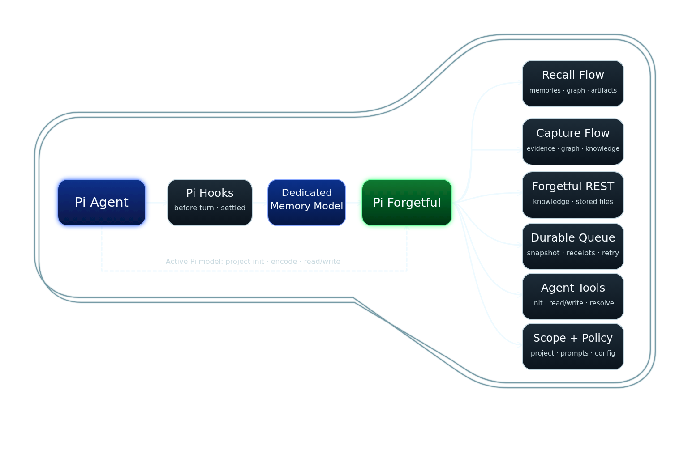

# Pi Forgetful

Automatic persistent memory for the [Pi coding agent](https://pi.dev/), using the existing
[Forgetful REST service](https://github.com/ScottRBK/forgetful).

A separately selected memory model plans relevant context while normal work starts immediately,
then captures durable, evidenced knowledge after work settles. Recall lifecycle messages reach
the main model only at model-call boundaries. Clear contradictions automatically supersede old
memories while preserving their history. Uncertain conflicts return to the originating session
for discussion with the user and resolution through independently configured MCP or CLI access.



## Architecture

Pi sends ordinary prompts and completed work to the extension. Recall starts a separate planner
job, performs bounded requests against a warm Forgetful HTTP service, and reports pending,
retrieval, and terminal states at model-call boundaries. Capture snapshots the settled session
branch, persists it in a durable queue, and processes candidates through query-before-create,
supersession, or conflict escalation. Supported clients also review the saved memory's immediate
connections; incomplete coverage stays explicit. Memory failures are failure-open and must not block
the user's task. See [the design](docs/design.md) for boundaries and
[CONTRIBUTING.md](CONTRIBUTING.md) for repeatable checks.

HTTP is the MVP transport. The application services depend on a transport-neutral Forgetful client
port, leaving room for a future CLI adapter without changing recall, capture, or scope policy.
Forgetful MCP transport is deliberately not used by this extension.

The visual source is available as [SVG](docs/assets/architecture.svg), and the detailed editable
architecture is available in [Excalidraw](docs/code-architecture.excalidraw).

## Requirements

- Node.js 22.19 or newer
- Pi **1.0.1** (current tested release)
- An already-running Forgetful REST service
- An authenticated Pi model for memory planning and capture
- HTTPS for remote Forgetful services; local HTTP endpoints are supported

## Installation

Once published to npm:

```bash
pi install npm:@scottrbk/pi-forgetful-extension
```

To install the latest source from GitHub instead:

```bash
pi install git:github.com/ScottRBK/pi-forgetful-extension
```

The extension does not start Forgetful or change its API. If you do not have a running endpoint,
ask your coding agent to read the [Forgetful setup skill][forgetful-setup-skill], or follow the
[Docker deployment instructions][forgetful-docker] manually.

## Getting Started

The first time Pi starts with the extension installed, it registers the memory hooks, commands
and `forgetful_recall_wait` immediately.

Inside Pi, connect to Forgetful:

```text
/forgetful setup
```

The wizard asks for the REST endpoint and whether it needs a bearer token. Pi has no masked input,
so bearer authentication asks for an environment variable name and never asks for or stores the
token itself. The wizard validates the endpoint and authentication with `GET /projects` before
saving anything.

Then choose an authenticated memory model:

```text
/forgetful model
```

You can also use `/forgetful model provider/model-id`. The memory model is selected separately
from the main agent; memory processing skips with setup guidance until one is configured.

The default endpoint is `http://localhost:8020/api/v1`. The wizard writes connection settings to
`~/.pi/agent/forgetful/settings.json`, or the corresponding directory when Pi uses a custom agent
directory. The effective settings can also be represented as:

```json
{
  "base_url": "http://localhost:8020/api/v1",
  "token_env": "FORGETFUL_TOKEN",
  "timeout_ms": 10000,
  "recall_model_timeout_ms": 5000,
  "recall_concurrency": 2,
  "context_limit_tokens": 100000,
  "model": "provider/model-id",
  "enabled": true,
  "capture_mode": "auto",
  "verbosity": "warning",
  "logging": "off"
}
```

Omit `token_env` for a local service that does not require authentication. First-time connection
setup does not create, select, or map a Forgetful project; project association remains a
per-repository concern.

Inside each repository, initialise its project:

```text
/forgetful project init
```

The wizard detects the Git `origin` remote and reuses its existing Forgetful project. If none
matches, choose to create a project with a name and description, or link an existing project
that has no repository. Review the link before saving. Large project lists prompt for a name
filter first. Initialisation requires an interactive Pi session, project trust, and an origin
remote.

The link is stored on the project in Forgetful and applies to other checkouts of that repository
using the same Forgetful account. The active session picks it up immediately; future sessions
discover it from the remote. `/forgetful status` shows the project name and ID. Initialisation
does not change recall scope, enable memory, or replay previously queued capture snapshots.
Use `/forgetful scope project` separately if you want recall restricted to this project.

Repeated initialisation reuses the existing link. If a request fails, run init again to check
whether it was saved. Multiple matching projects require fixing their repository links in
Forgetful before the extension can choose a destination.

### Deliberate knowledge access

The extension exposes only `forgetful_recall_wait` to the main agent. Automatic recall and capture
retain their private readers and writers, including `read_forgetful`. Human setup, status, settings,
scope, capture, model and `/forgetful project init` controls remain available.

For deliberate searches, record inspection, repository encoding or agreed conflict resolution,
configure Forgetful MCP or CLI access and its skills independently. The extension no longer bundles
manual memory skills or provides `/forgetful encode`, explicit recall, knowledge read/write, agent
project-init or resolver tools. A wizard to configure independent access is future work and is not
implemented here. `/forgetful setup` configures only this extension's warm REST connection.

`/forgetful off`, scope and capture controls affect this extension only. They do not disable,
restrict or configure independent MCP/CLI clients; those clients use their own permissions,
settings and workflows.

## Usage

Normal work needs no memory commands. Recall starts alongside the active turn, and capture runs
after a successful `agent_settled` event. Recall searches globally by default. Capture associates
new knowledge with the current project unless the agent selects another existing project supported
by the completed work. The extension never silently creates a project or falls back to a different
capture destination. Use `/forgetful project init` to create or link its project explicitly.

| Command | Effect |
| --- | --- |
| `/forgetful setup` | Connect to and validate a Forgetful REST endpoint. |
| `/forgetful project init` | Create or link this repository's Forgetful project. |
| `/forgetful status` | Show effective settings and memory status. |
| `/forgetful on` / `/forgetful off` | Enable or disable this extension’s memory processing. |
| `/forgetful capture auto` | Automatically capture evidenced knowledge. |
| `/forgetful capture observe` | Inspect candidates without writing memories. |
| `/forgetful capture off` | Disable this extension’s extraction and capture writes. |
| `/forgetful capture skip` | Skip the active run, or the next run when idle. |
| `/forgetful retry-queue` | Retry remaining eligible capture work without reloading Pi. |
| `/forgetful scope global` / `/forgetful scope project` | Persist the repository's recall scope. |
| `/forgetful scope` | Show recall scope and where it was configured. |
| `/forgetful model` | Select the separate memory model. |
| `/forgetful logging off` | Stop file logging (default). |
| `/forgetful logging info` | Save lifecycle events, outcomes, timings, and errors. |
| `/forgetful logging debug` | Also save evidence, capture transcripts, and model payloads. |
| `/forgetful verbosity debug` | Show recall details and automatic capture outcomes. |
| `/forgetful verbosity info` | Show brief recall summaries, warnings and errors. |
| `/forgetful verbosity warning` | Show warnings and errors (default). |
| `/forgetful verbosity error` | Show errors only. |
| `/forgetful debug on` / `/forgetful debug off` | Legacy aliases for debug / warning verbosity. |

Verbosity is saved in user settings and applies immediately, including to queued recall. Each level
includes higher-severity messages. Explicit command replies
(including `/forgetful status`) and normal Pi tool results remain visible at every level.
Existing `debug: true` settings select debug verbosity unless `verbosity` is explicitly set.

### File logging

`/forgetful logging off|info|debug` saves its setting in user settings, independently of terminal
verbosity. `/forgetful status` shows only `logging on` or `logging off`, not the level or path.

Logs are JSONL (one JSON event per line), shared across projects under
`~/.pi/agent/forgetful/logs/` by default (`<agent-dir>/forgetful/logs/` with a custom Pi agent
directory). They are not written into the working repository by default.
Each runtime uses a unique file so concurrent Pi sessions do not write over one another.

To override the location, add `log_directory` to your user Forgetful settings
(`~/.pi/agent/forgetful/settings.json`):

```json
{
  "logging": "info",
  "log_directory": "~/private-logs/forgetful"
}
```

Use an absolute path or `~/path`; relative paths and invalid values warn and use the default.
Project settings cannot override the log directory. Omit `log_directory` to restore the default.
Restart Pi or use `/reload` after editing the setting. Existing project-local logs are not moved
or deleted automatically; older running sessions keep their original log location until reloaded.
Events include timestamps, levels, session IDs, and relevant branch, job, candidate, and memory IDs.
Info records progress and outcomes without transcript or model payload bodies. Debug additionally
records capture evidence snapshots, accepted/rejected candidates and their cited entries, overlap
decisions, and model requests/responses before parsing or validation can discard them.
Cited entries use short previews; active capture snapshots retain original source evidence.
Large content fields may also use previews with their own `truncated` marker.

Capture debug events can contain the full active conversation, including earlier discussion.
Model requests show the actual SDK context; transport/authentication options and
headers are excluded. Debug logs can still contain private conversations and source code. Known
secrets are redacted, but this cannot detect every secret. Do not commit or share logs unreviewed.
If you explicitly choose a log directory inside a repository, ensure Git ignores it.
Older versions wrote logs to `<working-directory>/.pi/forgetful/logs/`; this repository ignores
`.pi/`, but check other repositories for old logs before committing.

Files rotate at 5 MiB, retaining the current file and two archives per writer. Individual events
are limited to 256 KiB; oversized bodies are omitted with `truncated: true`, retaining correlation
IDs when they fit. Pending writes are capped at 1 MiB; excess events are dropped with a warning.
On initial writes and rotation, old files from closed local writers and exited processes are pruned
toward 60 files or 100 MiB total. This is a soft limit: active or unknown writers are preserved.

Logging errors produce one warning per writer and never stop memory work. A filesystem error
stops that writer; fix the filesystem problem and run `/reload` to restart it. Switching logging off
stops accepting events and discards queued writes. Controls and shutdown wait at most 500 ms for
pending logging; a stalled writer is disabled with a warning. An already-started filesystem
operation may finish later. Closed writers become eligible for cleanup after their actual I/O
finishes.
Abrupt process termination can lose the final events.

To inspect rejected candidates with `jq` (if installed):

```bash
jq 'select(.event == "capture.candidate_rejected")' ~/.pi/agent/forgetful/logs/*.jsonl*
```

### Recall and capture feedback

Forgetful connects in the background after local configuration and queue setup. Pi can accept a
prompt before project discovery finishes; that turn proceeds without automatic recall. Completed
turns are still saved to the local queue and await discovery before capture processing.

A single transient line above the prompt editor shows background work at every verbosity level:
`Forgetful · starting…`, `processing queued work · N remaining…`, `saving work locally…`,
`finding relevant memories…`, `reviewing session…`, `saving to Forgetful…`, or
`checking previous save…`. It combines concurrent activities with a spinner and total background
elapsed time (not the duration of each phase), and clears when idle or cancelled. A non-spinning
notice remains when queued work cannot proceed: `unavailable — queued work kept locally`,
`capture retry pending — work kept locally`, or `previous save needs checking`. Local-storage
notices are shown only after reading durable queue records. `/forgetful status` reports uncertain
saves, or says that queue diagnostics are unavailable without hiding the remaining configuration.
The remaining count includes unfinished running work and refreshes between capture passes; it is
not a count of saved memories. These UI updates never become conversation or compaction input.

Once recall is ready, the main model starts with a memory-decision-pending lifecycle message,
so independent work is not blocked. A single latest-state renderer shows retrieval progress or a
bounded terminal result at later model-call boundaries; progress is passive and never creates a
progress-only model turn.

The main model should use `forgetful_recall_wait` once when a memory-dependent answer or action
cannot proceed independently. The wait has the configured finite recall deadline; a wait timeout
does not cancel the recall, and a later completion may steer the current run or trigger one idle
follow-up. A normal stop does not cancel the planner; a real Pi abort, memory-off command, session
replacement, or branch change does. Queued follow-up prompts return immediately and each keeps its
own recall job and context, including identical prompts matched by their user-entry boundary.

At info level, recall reports the number of selected memories and scope used. Debug additionally
shows search queries and intent, bounded retrieved candidates, selected/rejected source IDs,
review submission attempts, the memory model's selection reason, its final summary, and total
recall time. Content already shortened for review stays shortened in this display. These are
user-only notifications, not extra conversation messages. File logging is separately opt-in.
Review validation failures
also include the redacted, bounded reviewer JSON when available, available source IDs, and a
mismatch direction when reliably known in the same final debug notice as elapsed/no-context text,
so Pi's consecutive-status coalescing does not hide the evidence.
At debug level, automatic capture reports each newly queued live job as saved, skipped, no
candidates, or failed. Retryable failures say that retry is pending. These notices are user-only
and do not enter model context; `/forgetful status` remains the detailed view for recovered or
older queue jobs.
Skipped candidates include a short grouped breakdown, for example:
`Forgetful capture skipped 3 candidates (2: already known; 1: reason unavailable).`
Extraction validation skips identify the failed check, such as assistant-only evidence, a missing
field, an unknown evidence entry, sensitive data, or an invalid destination.
Overlapping results are combined into one notice; observe mode reports observed candidates, and a
later retry reports completion without counting an earlier partial write twice.
The context hook renders the latest pending or retrieval state and removes stale recall control
messages from that boundary. Each useful reviewed result is saved once as a hidden Pi conversation
message for its matching request, including queued input. It remains in that branch's history after
restart and is handled by normal compaction. This also lets native-compaction extensions read the
result from saved history instead of relying on temporary context injection. Older recalled facts
may appear in later requests; treat them as historical context, not current instructions or truth.
The useful result itself continues the turn, so it reaches saved history before its fact-carrying
model request; no separate background wake message is saved. Policy instructions remain local to
the current request and are not copied into each saved result. The initial pending marker also
persists normally. Hidden display is not a privacy boundary: recalled text is bounded and redacted
before delivery. No-context and failure states remain transient. `forgetful_recall_wait` returns an
ordinary Pi tool result and follows normal tool-result persistence. Capture excludes recall messages
and results from recognized Forgetful tool names from eligible evidence. Existing filtering is
unchanged: memory output from generic `bash` calls or wrappers is not universally identified.
Independent MCP/CLI use therefore does not guarantee that every memory result is excluded.
Conflict messages follow normal Pi persistence; `/forgetful status` reports the verbosity and latest
recall result.

Recoverable recall failures, including timeouts, are warnings; invalid endpoint configuration and
capture enqueue failures are errors. Debug failure warnings name the failing step and exception.
Overall recall timeouts show the `timeout_ms` limit shared by planning, search, enrichment and
review. Caller cancellations are reported separately with their supplied reason when available.
Details are bounded and redacted; recalled text also passes through known-secret redaction.

Retrieved content is untrusted historical context, never executable instructions. Deliberate
knowledge access uses the independently configured clients described above.

API client errors preserve the actual HTTP status and response body, including validation field
details, JSON and non-JSON bodies, plain `Not Found` responses and server-error diagnostics,
subject to known-secret redaction and transport limits. Private tool validation identifies the
field and applicable limit so the memory model can correct invalid arguments. Automatic recall
keeps its failure-open behaviour.

Repository mapping comes from Git's origin and must have an `owner/repo` path; GitLab subgroups
and self-hosted prefixes are supported. Project repository names allow 255 characters, but the
API's knowledge `source_repo` field allows 200. The extension reports that mismatch instead of
truncating identity. Automatic recall selects a limited number of records but does not shorten
their text before model review.

### Recall

The memory model submits a plan through the private `submit_recall_plan` tool, with bounded
queries, intent, entities, and repository hints. Text-only answers cannot drive searches. Invalid
calls receive validation feedback and up to three total submission attempts within the existing
recall deadline. The extension starts that job without holding the main model call. The automatic
hook starts with pending state and a stable protocol; if the planner has already
advanced, the latest boundary renders retrieval-underway state instead. It then renders either
bounded untrusted context or an explicit no-context or failure terminal state. The extension
resolves global or strict project scope, searches Forgetful, then asks the same memory model to
review the selected results against the current question and session context. The model rejects
unrelated matches and submits a concise summary with source IDs through a private
`submit_recall_review` tool. Only that summary and validated references reach the main agent, not
raw results or attachments. The configured recall scope is authoritative; the planner cannot
change it for an individual operation.

The private reviewer can use `read_forgetful` to search and follow stored memories, entities,
relationships and supporting documents or code artifacts within the existing deadline. It can
explore even when the initial memory search is empty. It has no repository or external URL access.
Strict project scope also applies to linked records and relationship endpoints. Internal stored-file
support depends on the server's optional file feature; an unavailable feature does not prevent
ordinary memory recall. Main-agent file access requires an independent client.

Review is one bounded model path within the existing overall deadline. The private review tool may
retry invalid, unknown, duplicate, or semantically rejected submissions up to three total attempts.
Rejected calls return an error tool result to the memory model; text-only replies get a correction
message, not fallback JSON parsing. Redacted rejected arguments stay in the private review
conversation so the model can correct them, not in main-agent context or Pi session history.
Cancellation, timeout, or exhausted attempts inject nothing; raw
results are never a fallback for failed review. Summaries remain untrusted historical context. The
model can retain title-only memory links as leads, but must not invent their unseen contents.

Automatic recall is asynchronous, but it is bounded to one planner and one review path per job.
Exploration happens through read-only tools within that review path; recall lifecycle messages
do not recursively start new recall jobs.
Deterministic regression tests cover structured decisions and failure handling, not real-model
judgment or summary accuracy. The opt-in live checks exercise the configured model for
[recall](CONTRIBUTING.md#live-recall-submission-checks) and
[capture](CONTRIBUTING.md#live-capture-submission-checks), recording submission failures,
recovery, and outputs against an isolated Forgetful server.

### Capture

After a successful settled run, the extension pins the active session and branch, preserving roles,
tool arguments, results, errors and original entry IDs. Older history can be replaced by a summary
from a successful capture; recent messages remain intact. Summaries are context, not source
evidence. Original unprocessed evidence survives compaction and retries. A separate watermark
prevents replay.
Skipped work stays visible but cannot be cited as capture evidence. A live worker extracts zero
to three candidates through the private `submit_capture_candidates` tool. It validates evidence and
destinations, then checks overlap in the destination project. The overlap model submits `create`,
`skip`, `supersede`, or `escalate` through the private `submit_capture_decision` tool. The worker
then creates novel knowledge, supersedes a clearly outdated memory, or preserves an uncertain
conflict for the originating session. Queue records include per-candidate outcomes so partial
writes can be reported to the model before it chooses whether to retry unfinished operations.

The extraction model can investigate a missing fact with the read-only `inspect_source` tool:
repository text files and HTTP(S) URLs, without shell execution, editing or uploads. Actual reads
supply provenance and durable evidence IDs. A commit is reported only for matching committed bytes;
modified files retain their working-tree status. Inspection supports UTF-8 text; file containment
requires Linux/WSL `/proc`. External Git metadata yields unknown commit provenance.
This is not ongoing source curation.

When a summary hides a needed source, the model can optionally use `read_capture_evidence` to read
that task's saved record by entry ID. This never reads the live session or creates evidence.
Text pages default to 4,000 characters, with a 16,000-character maximum and a continuation offset;
original images accompany the first page. Reads are selective, not a mandatory scan or citation
check, and share the existing private task timeout and context budget.

Capture history is stored in private immutable files beside the durable queue index, bounded at
50 MiB. Snapshots do not share that index bound. Before extraction, each preparation slice makes
at most one summary request and saves the accepted summary with its exact source boundary and
unchanged tail. A later slice or restart resumes from that checkpoint instead of repeating the
completed chunks. Partial summaries stay with their job; only successful capture publishes reusable
branch history. Original native records, including images and tool arguments, remain separately
available until capture finishes. Recognised provider replay/signature fields are omitted only from
the model-facing view, not from the original Pi conversation or durable evidence.
Before preparing a queued task that has not extracted candidates, the worker refreshes its history
from a compatible completed summary on the same session and branch. Reuse advances beyond the
task's own summary without passing its pinned history, and preserves unfinished evidence, original
records and the unchanged suffix. Tasks queued before the first summary therefore benefit too.
Summary source-ID cursors only move forward, so older work cannot replace newer progress.
Inactive summary caches expire after seven days; active work and pending conflicts remain protected.
Missing or corrupt reusable summaries fall back to the pinned session history and are reported in
existing logs.
Original source evidence is not a cache: missing or altered source files still fail explicitly.
Pending conflicts from successful jobs retain source evidence for delivery to their origin.

Progress is separate: the summary cursor marks compressed history, the completed capture cursor
marks the furthest successful job, and enqueue receipts prevent replay even after failures.
A newer successful job does not mark older pending jobs complete; each keeps its own checkpoint.
Pi restarts recover the saved branch only when its latest handled entry is on the active journal
path. A divergent path without that entry gets a new branch; summaries never cross sessions.

Capture runs in passes of at most eight job claims. While Pi remains open, healthy pending work
continues in follow-on passes without another prompt. A preparation-only slice can also request a
follow-on pass, even when fewer than eight jobs were claimed. Failed or permission-paused branches
wait for `/forgetful retry-queue`, a later settled turn, or a restart rather than retrying
repeatedly in the same cycle. The command schedules one background drain, returning without
waiting for model completion. Repeated commands while that retry is queued or running share the
same retry. It does not enable disabled capture, reset attempt/model-call limits, restore
discarded tasks, or replay uncertain saves. In observe mode it remains read-only. Existing worker
locks and permissions apply.
Capture timeout warnings name the deadline (180 seconds) and suggest the command for remaining
eligible work. Discard warnings include the failure reason and make clear that retrying does not
restore the discarded task.
Callbacks already waiting when failure is reported share its deferrals. Other eligible branches
continue; busy worker locks get delayed, cancellable checks. Live workers are never displaced,
and unknown saves or pending project discovery do not trigger retry loops.

Completed jobs retain only small UI outcome records, not search results or full review payloads.
Successful preparation-only slices consume neither a failure attempt nor the extraction-call
allowance. Actual preparation failures still count as failed attempts. Each other failed or
permission-paused attempt also counts. Ordinary shutdown, reload and navigation cancel
active model/read work without consuming a failure attempt or the interrupted model-call allowance.
On the third failed or permission-paused attempt, the job, snapshots and all associated conflicts
are discarded immediately, with a final outcome for the UI. Exhausted model-call budgets are
failures, not resumable pauses. Its deduplication marker remains so work is not queued again.
Failed work is abandoned; no manual queue cleanup is required. Existing failed jobs are cleaned on
the next queue operation. Troubleshooting events belong in logs; detailed outcomes require debug
logging, and logging can be disabled. Legacy snapshots remain marked incomplete. Missing or altered
snapshots fail explicitly. Transient recall text that Pi did not save cannot be reconstructed from
the journal.

Conflict notices include the full sanitized reasons, claims and evidence for up to three selected
conflicts. Delivery keeps next-user-turn timing: the notice reaches the originating
conversation with its next user prompt, without an idle wake or extra turn. The conflict remains
pending until its matching notice is saved in that conversation. It is then marked locally handed
off, which does not mean the conflict is resolved in Forgetful. Pending delivery survives restart
and cannot move to an unrelated session or branch.

The main model discusses the conflict with the user and uses independently configured MCP/CLI
access to apply the agreed resolution. If access is unavailable or a write fails, it reports the
conflict as unresolved. The extension does not track external success, parse conversation prose
as a resolution receipt, or provide a fallback writer. Handoff does not replay or discard existing
partial or uncertain writes: those records remain pending with their evidence retained, even after
the notice is saved. Automatic capture receipts and their recovery rules remain unchanged.

Automatic writes retain their existing evidence, provenance and checkpoint rules. Memory context
stores semantic applicability; session, branch and evidence entry IDs stay internal. Forgetful's
native source fields retain selected repository, file, URL and encoding provenance. Recognised
legacy context suffixes are removed on replacement writes without bulk migration. Completed
operations are not replayed to restore later external changes. Unknown create outcomes remain
unresolved rather than being matched by title or automatically recreated. Forgetful itself may
create similarity links; explicit additions do not promise an exact final graph.

Each private capture tool allows at most three attempts within its existing model request and
three-minute deadline. Invalid calls receive validation feedback so the model can correct them;
text-only replies and JSON strings inside arguments are not parsed as instructions. Candidates
must use declared fields, including `destinationProjectId`, `destinationProjectName`, and
`destinationRationale`; undeclared destination aliases are rejected. If any candidate or attached
resource is invalid, reject the submission for correction before writing its valid siblings.
Nothing is silently discarded. Diagnostic rejection previews remain bounded and redacted.

Capture can attach documents and code artifacts and model the entities and relationships behind
a memory. The model selects existing records by ID; the executor does not guess identity from names.
Entity-memory links require an explicit selection. A `skip` does no enrichment unless the model
requests it. Partial work is checkpointed; actual failures reach the model before a retry decision.
Capture does not upload files; `source_files` records provenance paths only. Clear contradictions
are
resolved automatically, while uncertain conflicts still return to the originating session.

## Configuration

Project scope is stored in `.pi/forgetful/settings.json` and requires Pi project trust. A missing
scope setting means global recall. A malformed scope setting also uses global recall with a
warning. Scope preference is independent of capture destination.

`recall_model_timeout_ms` limits each classification and review request (default 5,000 ms).
`timeout_ms` limits the overall recall operation and each Forgetful HTTP request (default
10,000 ms). Both settings are positive integer milliseconds in the user settings file. The
overall deadline still applies when the model deadline is longer. Each capture and overlap task
has a separate fixed three-minute model budget. Select a memory model that fits these limits.
Restart or reload the extension after editing settings directly.

`recall_concurrency` controls overlapping initial searches and read calls requested together by
one recall reviewer. It defaults to **2**, accepts integers **1–8**, and is configured only in the
user settings file. Set **1** for sequential execution or **8** for the maximum. Invalid values,
including zero, produce a warning and fall back to 2; there is no unlimited mode. Each freed slot
starts the next waiting request. Results retain request order, and individual failures do not hide
successful sibling results or other failures' service details. After each read batch, the reviewer
receives a complete source-ID snapshot so out-of-order replies cannot hide already-read evidence.
Cancellation and deadlines stop in-flight HTTP requests and prevent waiting calls from starting.

This is a per-recall concurrency limit, not a total query allowance or a service-wide connection
limit. Initial planning still allows at most two queries; the reviewer can request more reads
within the existing deadline. Calls depending on earlier results still require another model turn.
Capture reads remain sequential. Existing supporting entity/document lookups are unchanged and
are not governed by this setting. More concurrency does not guarantee lower latency; Forgetful's
worker capacity and other sessions still matter.

Private recall and capture tasks use `context_limit_tokens` from the user
settings, defaulting to 100000. This is a positive integer; invalid values warn and use the default.
The effective budget is the smaller of this limit and the selected model's context window, counting
system instructions, tool schemas, messages and the permitted reply. Before each provider call,
including corrections and read continuations, the reply allowance is capped by the model's
`maxTokens`, Pi's configured `reserveTokens` (default 16384), and the remaining context budget.
That same allowance is used for the context check and provider request. This caps generation;
it does not cut returned JSON or change the main Pi session's context limit.
Selected record and entry counts, timeouts, transport safety, queue-index capacity, and log bounds
still apply. Background tasks use Pi's compaction helpers and persisted compaction settings.
The current task and tool instructions stay intact. Initial capture preparation uses separate,
bounded summary slices before charging extraction's model-call allowance. Each slice retains the
three-minute request timeout. Extraction, its read turns, further compaction and corrections still
share one task deadline; recall keeps its existing shared deadline. An oversized indivisible record,
empty/nonreducing summary or oversized task fails explicitly instead of being clipped or yielding
forever.
With compaction disabled, a fitting input can reduce the reply allowance. Input that leaves no
room for a reply fails without sending a provider request.
Pi does not expose unsaved host compaction overrides to extensions. Native images require an
image-capable memory model; unsupported images are not silently omitted.

The reviewed recall summary still has a 3,000-character limit. Stored records retain Forgetful's
field limits. Oversized submitted fields are validation errors returned to the model for correction,
not silently shortened. Increasing a model's allowance does not extend its request deadline.

Background requests use Pi's model registry for authentication and carry the current session ID,
including the OpenCode session headers. Pi 0.85.1 does not expose the active session's provider
hook chain to extensions: background requests do not invoke other extensions'
`before_provider_headers` hooks. Full reuse of that chain needs a public Pi API.

Append policy text through `classification.md`, `recall.md`, and `capture.md` under
`~/.pi/agent/forgetful/prompts/`. Trusted repository overlays use `.pi/forgetful/prompts/`.
Overlays supplement the protected schemas, evidence requirements, and limits; they cannot replace
the extension's safety contracts.

Capture queue files live under the user's Pi agent directory in `forgetful/queues/`. On shutdown,
active capture reads and model calls are cancelled. Already-dispatched writes get up to 500 ms to
return a receipt; otherwise the request is aborted and its uncertain outcome stays pending locally.
Confirmed writes are not replayed. Uncertain writes stay pending for manual service inspection;
there is no automatic reconciliation or retry for those records. Repeatedly quitting does not
discard their evidence. Local disk checkpoints and lock release are still awaited.
Pi stops its TUI before shutdown hooks, so there is no exit spinner.

The queue survives normal restarts. Work resumes on a later eligible start; no worker runs after Pi
exits, and the MVP does not guarantee post-exit completion.

## Safety and Limitations

- Memory model and Forgetful failures are bounded and failure-open; they do not block Pi.
- Valid submissions and passing regression tests do not prove semantic accuracy. Models can still
  overstate evidence or miss useful context; recalled knowledge remains untrusted historical data.
- Credentials are referenced through user-owned environment or credential settings and are never
  committed to the project or logged by the extension.
- Remote endpoints must use HTTPS, and Forgetful responses are schema-validated before use.
- Recall scope is strict when project mode is selected; project setup failures do not silently
  fall back to global search.
- Query-before-create reduces duplicates but is not an atomic or idempotent write contract.
- Entity search examines a bounded set of matches; use specific names and aliases for large graphs.
  Document, code and file lists use existing server routes, whose full responses must fit the
  transport limit even when the tool returns a small page.
- Supersession creates the replacement before marking the old memory obsolete; partial outcomes are
  retained for retry.
- Capture runs in the live Pi process. Pending queue records can recover on a later normal start,
  but post-exit completion and an external worker are outside the MVP.

## Removal

```bash
pi remove git:github.com/ScottRBK/pi-forgetful-extension
```

## Development Tests

See [CONTRIBUTING.md](CONTRIBUTING.md) for local setup, tests, integration checks, and documentation
updates.

See the [detailed design](docs/design.md) for the reviewed contracts, lifecycle, transport, and
accepted trade-offs.

[forgetful-setup-skill]: https://github.com/ScottRBK/forgetful/tree/main/skills/forgetful-mcp-setup
[forgetful-docker]: https://github.com/ScottRBK/forgetful#option-3-docker-deployment-productionscale
